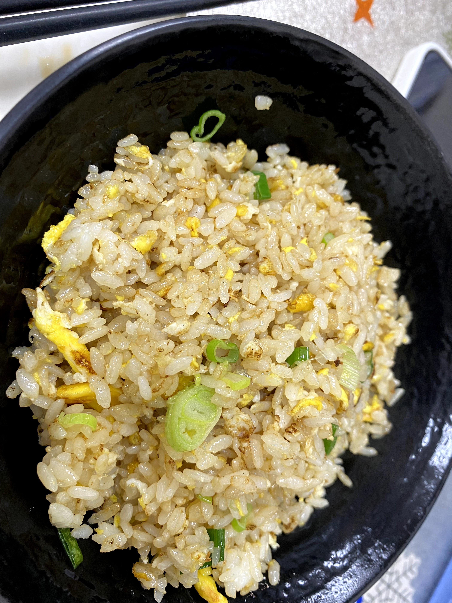
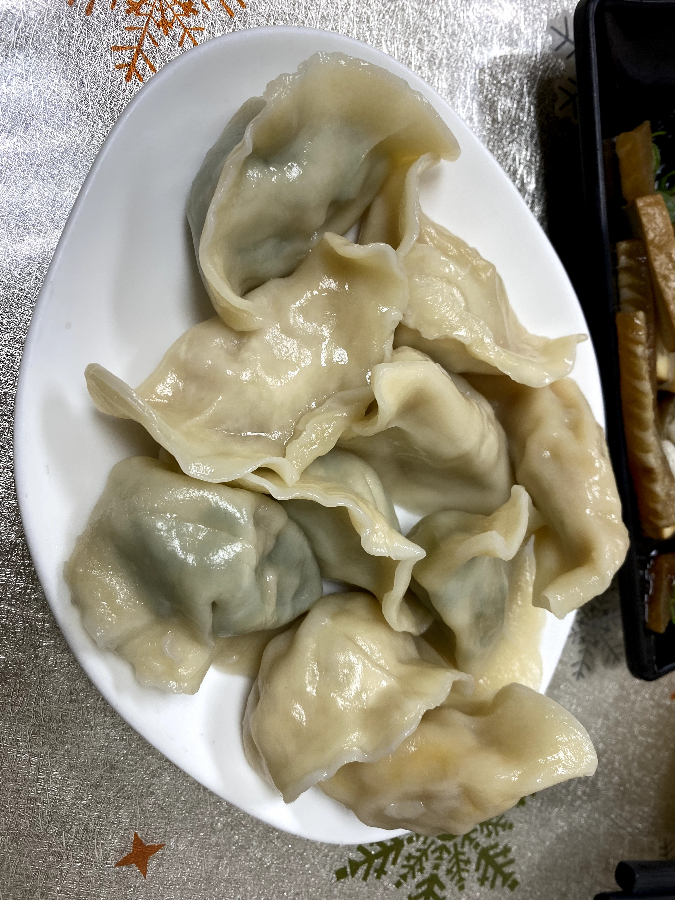
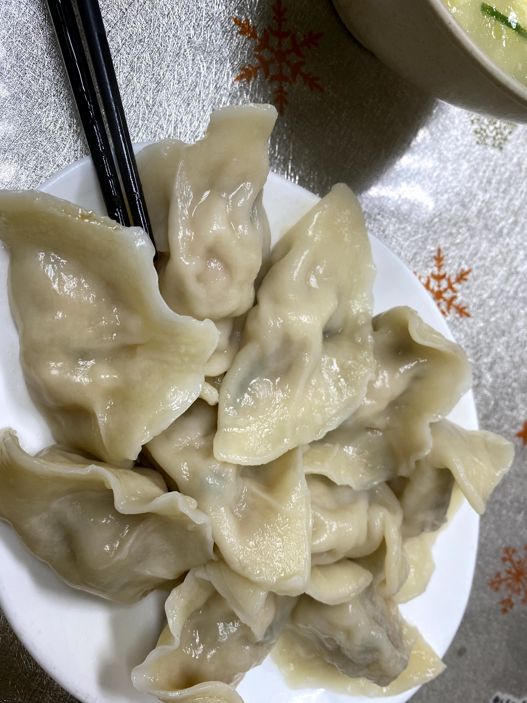

到目前為止,飯糰編覺得這是**北投最好吃的水餃**!完全值得給予全五星好評。

<YouTubeEmbed id="YZWOtaDeKWY" title="春風食堂 — 水餃店在哪裡,跟我們一探究竟" />

店裡有提供水餃外帶喔!帶回家煮來吃真的很過癮,牆上還貼著提醒要記得用大鍋子煮。

這次其實是第二次想吃這間水餃,上一次完全連線索都沒有,連找都找不到。這一次終於在米編的協助之下(感謝米編研究室的好夥伴),我們總算繞了一圈後找到這間好吃的水餃店。吃完還繞到自強街那邊,發現一片新天地——之前總覺得陽明出來往唭哩岸捷運站那邊就沒什麼吃的,現在才發現,好吃的都在自強街這邊呀!

12/13 之後我們又來吃了一次,這次外帶了 60 顆水餃回家(回米編家,飯糰編的家人還沒這個福氣享用到),米編家也是一致好評!

這間店的老闆、老闆娘都很古意可愛,來這邊用餐的都是熟客,完全不意外,一吃成主顧。歡迎大家來試試看,飯糰編五星好評!
