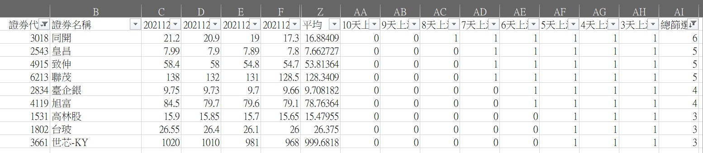
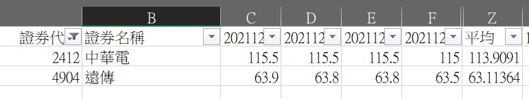
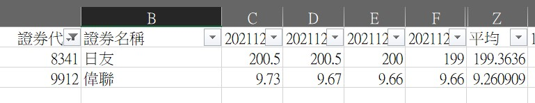
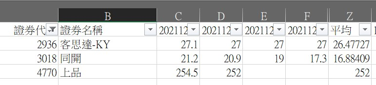

> 這是 2021 年的選股觀察紀錄,純屬當時的學習筆記,不構成任何投資建議。

**台股本日交易量能彙整**

- 台股本日收在 **17826.83** (+0.21%)
- 台股本日成交 **2519.87** 億
- 外資及陸資 買 超 **180.23** 億
- 投信 買 超 **1.79** 億
- 自營商(自行買賣) 買 超 **4.91** 億

**強勢股票篩選結果**

股價連續6個交易日不跌

股價連續7個交易日不跌

股價連續8個交易日不跌

↑ 總篩選的數字表示連續幾天不跌。
