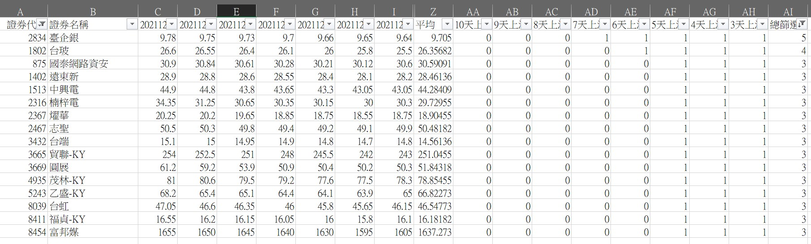

> 這是 2021 年的選股觀察紀錄,純屬當時的學習筆記,不構成任何投資建議。

**台股本日交易量能彙整**

- 台股本日收在 **17946**
- 台股本日成交 **2751** 億
- 外資及陸資 買 超 **86.02** 億
- 投信 賣 超 **5.62** 億
- 自營商(自行買賣) 買 超 **7.05** 億
- 融資 **2.06** 億
- 融券 **減少 5178** 張

**強勢股票篩選結果**

↑ 總篩選的數字表示連續幾天不跌。
