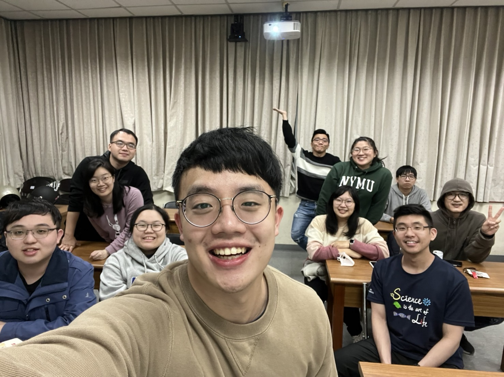

沛芫回V：太無禮了，太過分了，太失禮了\
我實在覺得太好笑了XDDD

跨年吃了胖老爹，肯德基，披薩，可頌，喝酒，玩switch，看跨年晚會

跨年夜，到卡咪過夜，We did nothing. Because 超累 回到卡咪已經快兩點半 而且我沒洗澡 跨年的時候喝了酒 身上酒味有點重…起床的時候米編說我睡覺的時候又打呼又磨牙（一定超吵QQ)

欸等等，上面那部分開頭怎麼有點高爾宣...

但這也代表我在這裡睡得很舒服，可以理解米編為什麼這麽喜歡卡咪

之前就多多少少有幾次覺得米編在暗示說太晚回去了，也許可以住在卡咪，但我總覺得因為有別的女房客在所以不好意思（畢竟在卡咪看到異性應該還是會覺得不太自在吧，而且又是在relaxing places）早上起床沖澡還可以聽到隔壁浴室瓶子罐子倒下來的聲音，為了避免被發現，真的是舉手頭足都要相當的輕盈才行。今天算是成就解鎖，想說跨年完借宿一晚應該也是合理的吧
