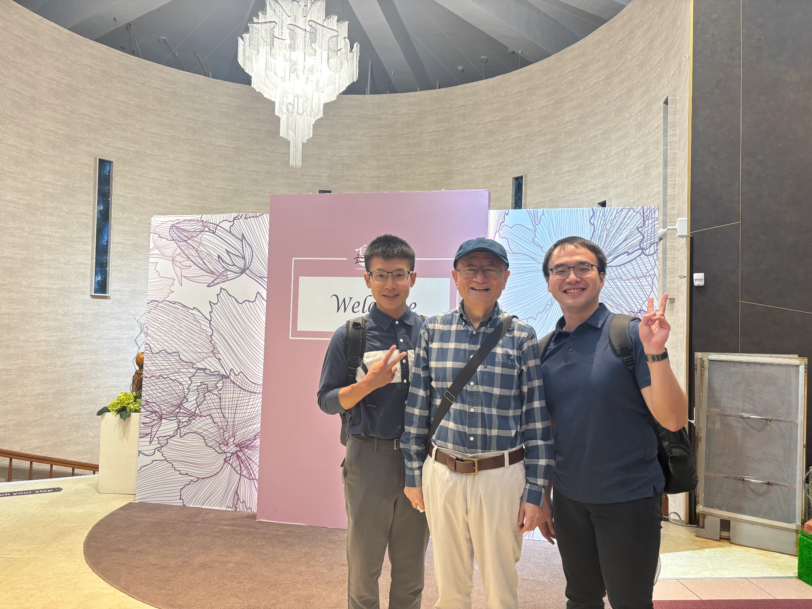
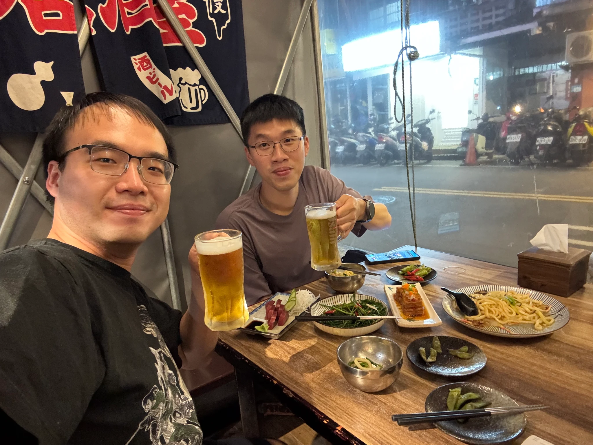
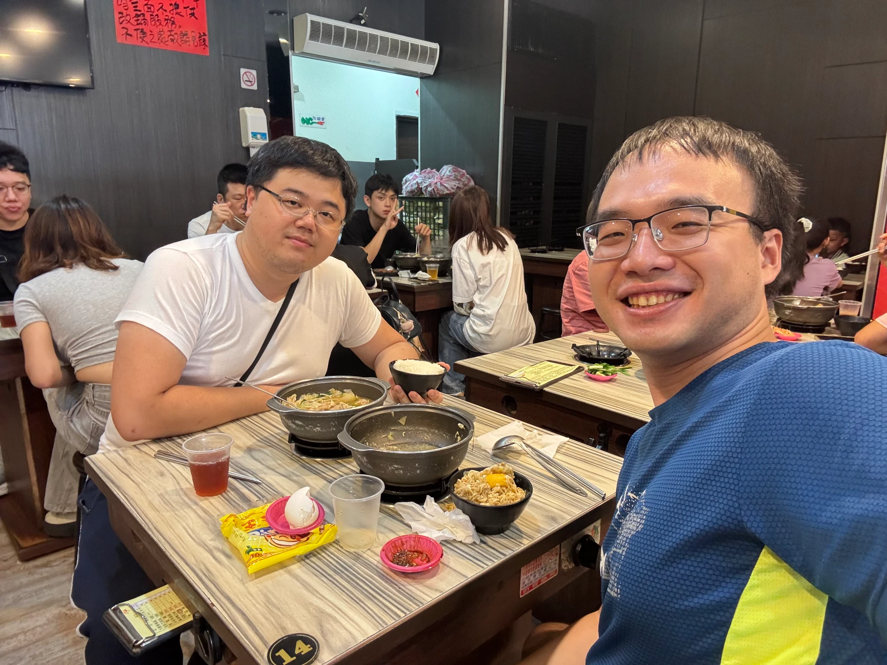
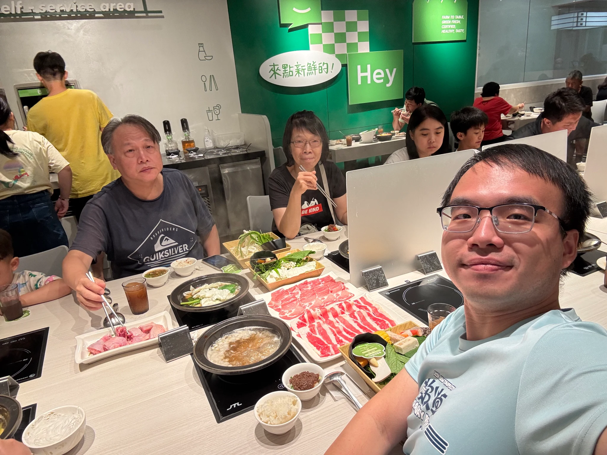
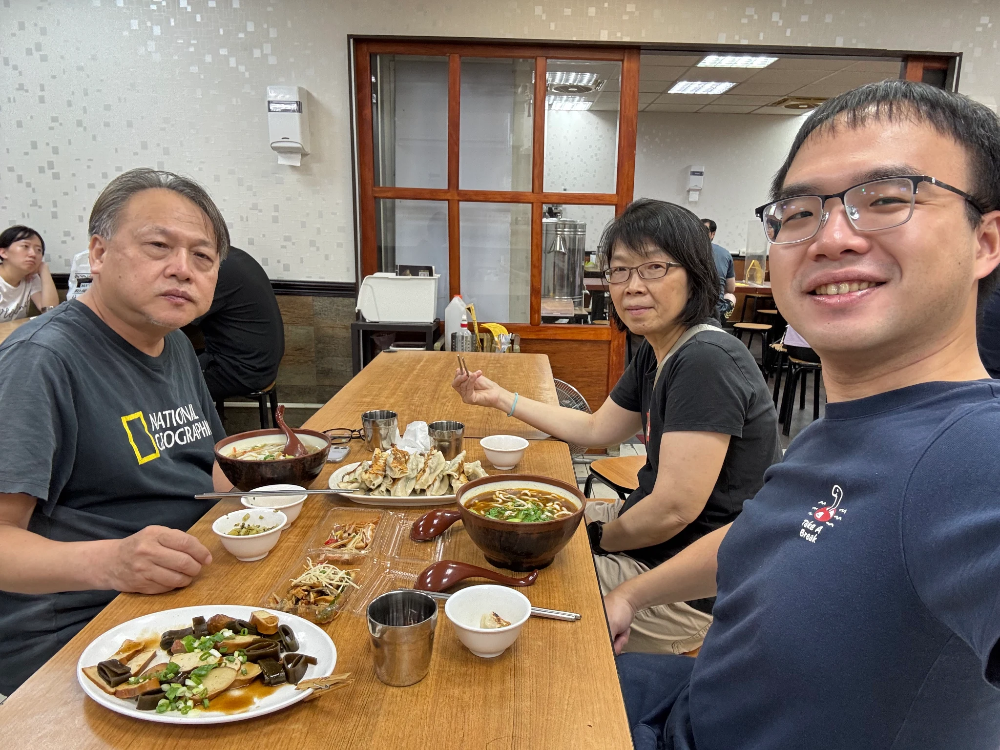

這個連假見了好多人，有一整年當網友的淡水大前輩、有藥業好夥伴大學同學老K，還有許久不見的智軒。然後跟拔麻吃了飯，心滿意足的收假回臺南\~

這是第二次跟段博士見面，上一次見面的時候大概半小時就先離開了。這樣遠端配合了一年之後，跟段博士之間的默契…蠻奇妙的，很聊的來。希望段博士活到160歲！

跟老K有個新的目標，就是要吃遍全台灣的居酒屋？

是許久不見的智軒，上一次約見面跟吃飯已經是整整兩年前了。時間過好快喔，他已經把他的日本的公衛碩士課程唸完了。希望他可以在台灣找到理想的工作！

還有一定要跟爸媽吃飯的！王老五鍋貼依舊的好吃（拔麻說茶不好喝了！？）我倒是對石二鍋有一點抱怨…他們更改了內部的裝潢，然後多數的用餐席位都變成兩人桌兩人桌。三個人以上的必須要併到大桌一起吃，壓力其實蠻大的。這樣的設計非常不理想。

這一年來每個禮拜天都都會有點小鬱卒，因為要回台南準備周間的上班。這一次是比較難得，因為要探訪段博士，所以禮拜三晚上就先回家了。爽😊這次充的電比較滿，準備迎接下週挑戰。
